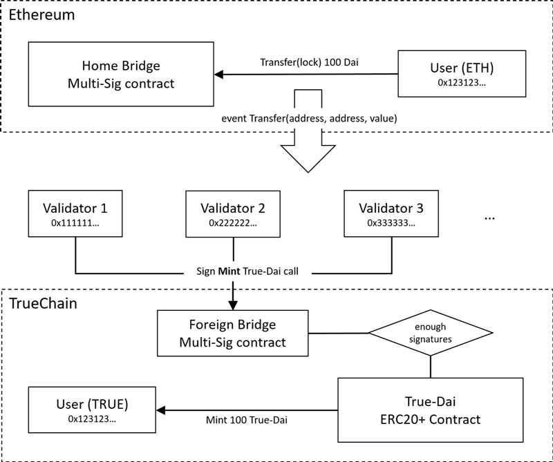
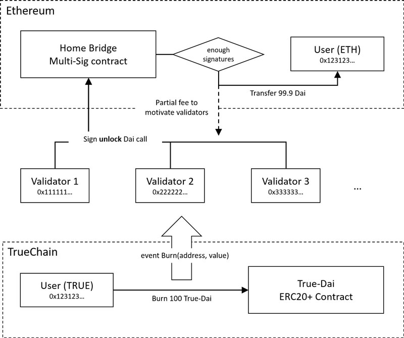

# True-Dai exchange system Validator

## build

```shell
$ npm install
$ npm run build
```

## start

```shell
$ node dist/index.js -s -c <your config file path> -k <your keystore file path>
# then you need to enter the password of your keystore
```

config.json looks like:
```json
{
  "service": {
    "port": "<service listening port>"
  },
  "homeNetwork": {
    "provider": "<ethereum http(s) provider>",
    "type": "eth",
    "tokenContract": "<Dai contract address>",
    "multiSignContract": "<ethereum multi-sign contract address>",
    "fromHeight": "<the starting block height of the subscription log: number>",
    "gasPrice": "<gasPrice: number>"
  },
  "foreignNetwork": {
    "provider": "<truechain http(s) provider>",
    "type": "true",
    "tokenContract": "<T-Dai contract address>",
    "multiSignContract": "<truechain multi-sign contract address>",
    "fromHeight": "<the starting block height of the subscription log: number>",
    "gasPrice": "<gasPrice: number>"
  }
}
```

and to view startup help

```shell
$ node dist/index.js -h
```

# Example: TRUE-DAI bridge Document

## Token bridge introduction

* The TRUE-ETH Dai Token Bridge includes two multi-sig contracts on two chains, a True-Dai ERC20 contract on TrueChain and several validators vote on cross-chain transactions.

* The solution locks existing Dai on Ethereum and use that as a representation to mint True-Dai on TrueChain.

* Tokens are locked/unlocked/minted/burned on-chain, i.e. through bridge smart contracts on Ethereum and TrueChain respectively. The smart contract functionality is invoked by a set of validators.

* Bridge contract functionality

  * Home bridge (Ethereum): Lock/unlock Dai, temporary storage the fee consumed during redemption
  * Foreign bridge (TrueChain): Mint/burn T-Dai
  * Bridge contracts know which TrueChain/ETH address to transfer to upon lock/mint and burn/unlock scenarios.
  * Multi-Sig acceptance of bridge functions on-chain. All functions can only be executed once a majority vote on-chain for a certain action by the validators has been reached.
    * A number of validators (Oracles) must sign off on the transfer, i.e. 3 out of 4, for a token to be bridged. To be specific, this means 3 out of 4 votes on-chain for a specific event - in this case mint.
    * Consequently, no single entity can execute the bridge functions - it must be a majority of validators signing off on a triggered event, by casting an on-chain vote for action on-chain (i.e. mint).
    * Example: Validators runs an ETH node and TrueChain node that listen for token events on the two chains and cast a vote for a specific transfer to go through. Once a transfer get 3 votes, then the function call will be executed.
    * Validators can be Maker/TrueChain/other trusted parties, (i.e. a dapp company on TrueChain)
    * Only whitelisted validators (a set of verified Ethereum/TrueChain addresses) is able to cast votes on the Multi-Sig functions. Preferably, more validators can be introduced by implementing functions that allow current validators to vote to include new whitelisted addresses.
* Audited source code, and access for Maker.
  * Preferably open source and thus verifiable by community.

### Dai from ETH to TRUE


### Dai from TRUE to ETH
